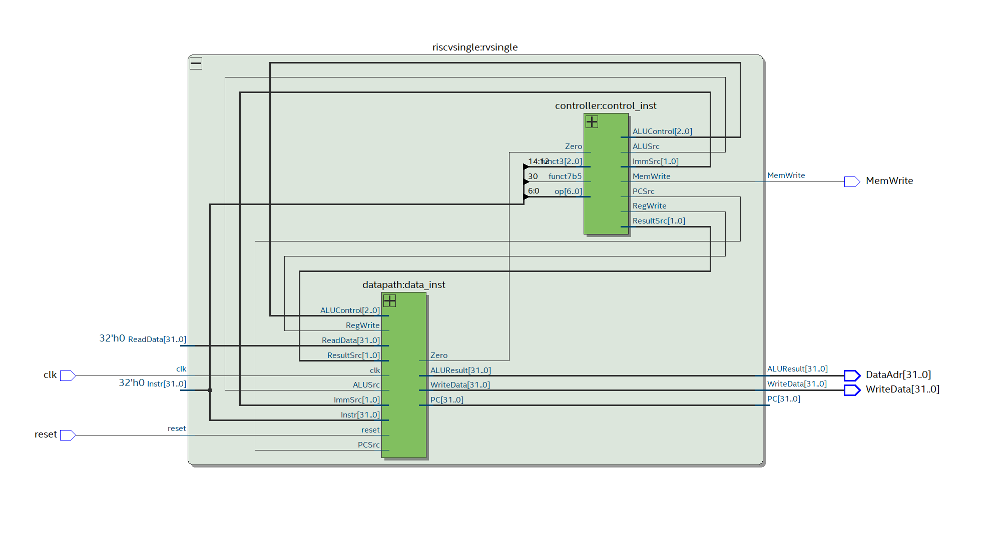
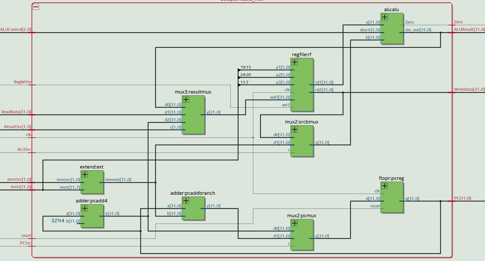
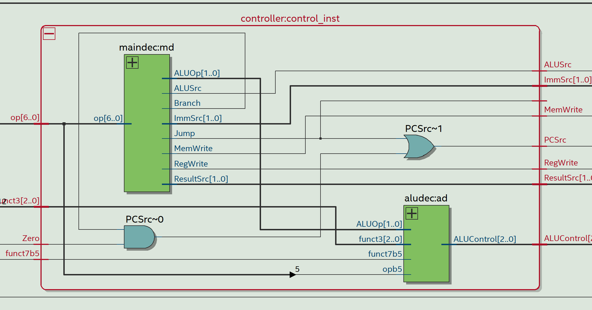

# Grape
Implementation of single cycle RISC-V processor, this is a tiny implementation without CSRs!

> Please checkout my Quark project which is a riscv processor that fully complies to the spec with CSRs, GPIO and a UART module connected to it so one can tinker around with it. 

## Datapath Schematic

## Control Path Schematic:

